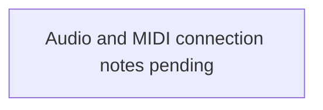

# Audio and MIDI connections

Status: initial draft awaiting source notes.

This document is the canonical overview of audio and MIDI routing in the TDA
live setup. It should describe physical connections, logical routing, channel
assignments, and any computer-mediated control paths.

## Source notes

Add the original notes here before reorganising them. Keeping the source text
alongside the diagram makes omissions and interpretation errors easier to
spot.

> Source notes have not been added yet.

## Diagram

## Open questions

- Which connections carry audio, MIDI DIN, USB MIDI, network messages, or
  another control protocol?
- Which devices generate clock, and which devices follow it?
- Which routes are required for a performance and which are optional?
- Which connections are physical cables versus software routing?
