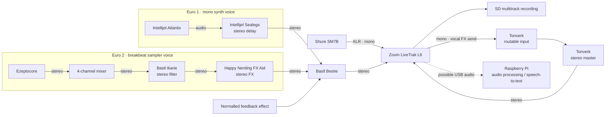
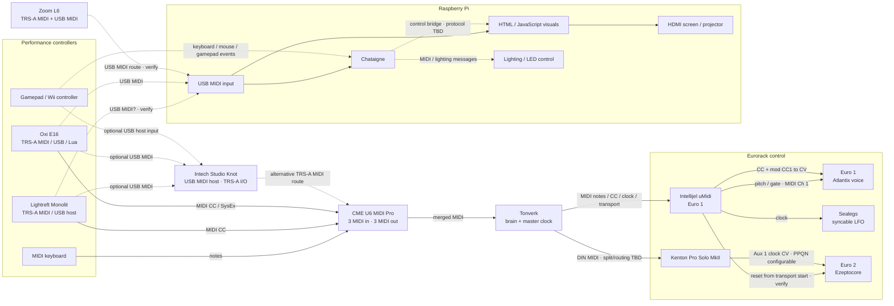

# Audio and MIDI connections

Status: working draft derived from the notes captured on 8 October 2026.

This document is the canonical overview of audio, MIDI, clock, control, and
visual routing in the TDA live setup. The untouched input is preserved in
[the dated source notes](source-notes/audio-midi-2026-10-08.txt).

Solid arrows below represent current wiring or a stated requirement. Dotted
arrows represent proposed, optional, or unverified paths. A solid arrow can
still have an explicit verification note where the physical connection is
known but its behaviour needs testing.

## Audio routing

Exact mixer-channel assignments remain in the source notes. The Bestie feedback
path is musically useful but changes the overall gain, so a repeatable way to
control its level remains an open performance-design problem.

## MIDI, clock, control, and visuals

## Device roles and current assignments

| Device | Current or intended role |
| --- | --- |
| CME U6 MIDI Pro | Merges the keyboard, Monolit, and E16 through three MIDI inputs before Tonverk; provides three MIDI outputs |
| Tonverk | Central musical brain, sequencer, and master clock; receives merged keyboard notes and controller CC from the CME U6; provides stereo master audio |
| Lightreft Monolit | Performance MIDI controller; intended to control Tonverk and potentially host a gamepad |
| Oxi E16 | Performance MIDI controller and Lua-capable translator for CC and SysEx |
| Kenton Pro Solo MkII | Converts MIDI clock to stable PPQN clock CV for Euro 2; spare aux outputs may later provide standardised CC-to-CV modulation |
| Intellijel uMidi | Converts Tonverk MIDI to pitch, gate, clock, modulation, and reset signals for Euro 1 and Euro 2 |
| Euro 1 | Atlantix mono voice through Sealegs stereo delay into Bestie |
| Euro 2 | Ezeptocore through mixer, Ikarie, and FX Aid into Bestie |
| Bastl Bestie | Performance submixer for both Eurorack voices and its normalled feedback effect |
| Zoom L6 | Main mixer, vocal input, stereo returns from Bestie and Tonverk, optional multitrack recorder, and possible Pi audio/MIDI interface |
| Raspberry Pi | Runs Chataigne and browser visuals; outputs HDMI; potential audio analysis, speech-to-text, and lighting control host |
| Intech Studio Knot | Optional USB MIDI host and TRS-A routing utility |

## Decisions and verification still needed

1. Confirm the CME U6 input/output assignments and define how Tonverk's output
   is split or routed to both uMidi and the Kenton.
2. Identify the installed Intellijel uMidi hardware/firmware version and the
   applicable updater or configuration application.
3. Verify that Tonverk's MIDI transport-start message reliably produces the
   intended reset CV from uMidi to Ezeptocore.
4. Record the Kenton clock division/PPQN setting and confirm whether the clock
   output described as `clock CV out` and `Aux 1` is the same configured output.
5. Confirm Zoom L6 USB audio and MIDI capabilities in the intended Raspberry Pi
   operating mode, including the available channel count.
6. Choose the Raspberry Pi's primary USB MIDI source and determine whether a
   powered hub or the Knot is required.
7. Verify whether Monolit's USB-C port carries MIDI and decide whether its USB-A
   host port or the Knot should host game controllers.
8. Decide how Chataigne communicates with the browser visuals and lighting
   system: MIDI, OSC, WebSocket, standard lighting protocols, or a combination.
9. Design a repeatable gain strategy for the Bestie feedback effect and the
   Zoom L6 vocal-to-Tonverk effects loop.
